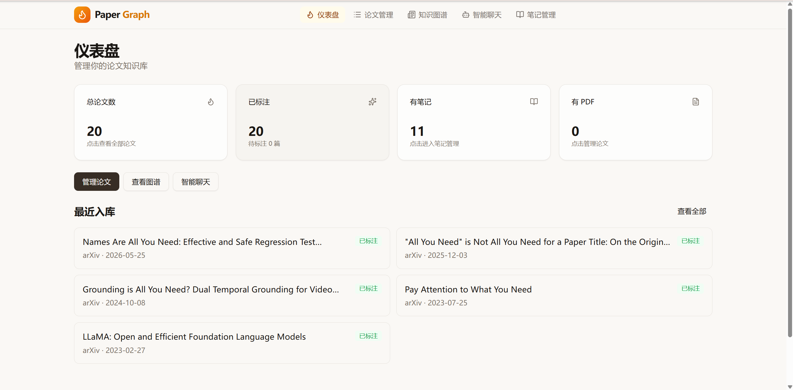
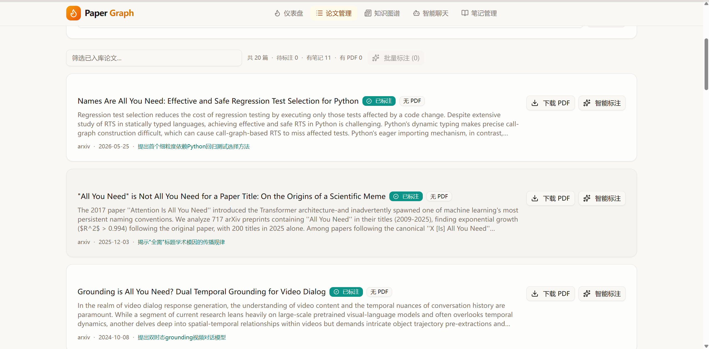
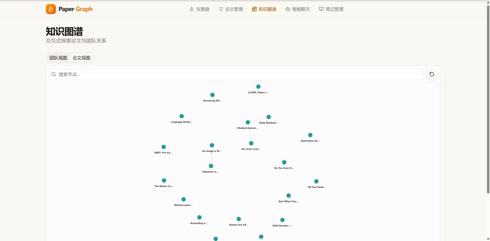
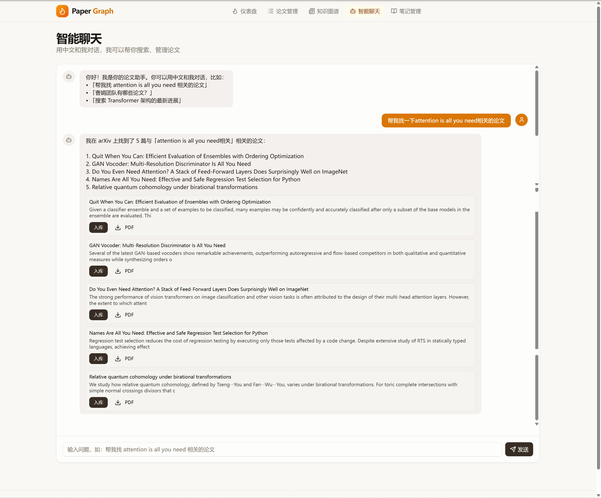
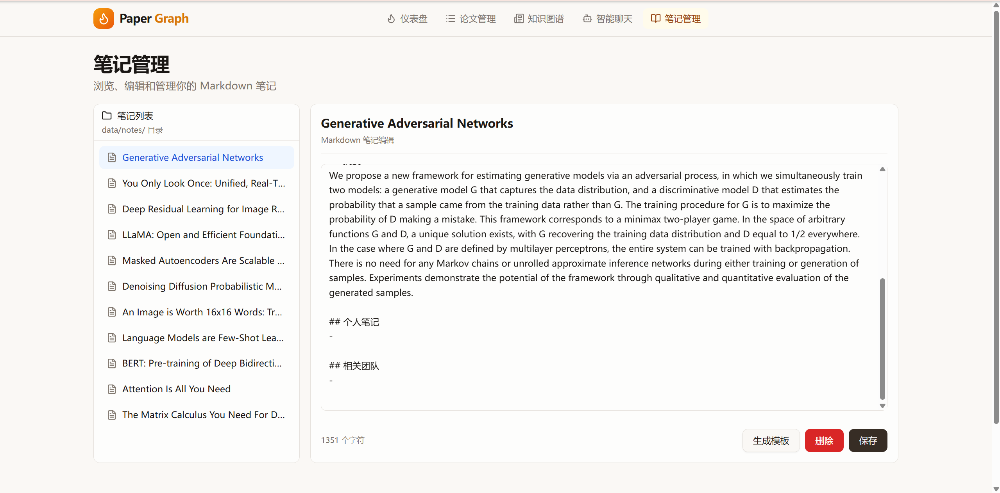

# Paper Graph Manager

论文图谱管理工具。以管理为核心，结合 AI 能力，帮助用户发现、评估、入库、分析和沉淀论文知识库。

## 快速启动

### 环境要求

- Python 3.12+
- Node.js 24+（已验证 v24.16.0）
- OpenAI API Key（用于智能标注和对话式搜索）

### 1. 配置 LLM

```cmd
cd backend
copy .env.example .env
```

编辑 `backend/.env`，填入你的 OpenAI API Key：

```env
LLM_API_KEY=your-openai-api-key
LLM_BASE_URL=https://api.openai.com/v1
LLM_MODEL=gpt-5.5
```

### 2. 启动后端

```cmd
cd backend
.venv\Scripts\activate
uvicorn main:app --host 0.0.0.0 --port 8000
```

后端默认地址：`http://localhost:8000`

### 3. 启动前端

```cmd
cd frontend
npm run dev -- --port 3000
```

浏览器打开：`http://localhost:3000`

---

## 项目简介

Paper Graph Manager 是一套面向个人研究的论文管理工具，覆盖从论文发现到知识沉淀的完整工作流：

- **发现**：对话式 AI 搜索或关键词检索 arXiv
- **评估**：浏览论文元数据，查看 PDF 状态，决定是否入库
- **入库**：支持 arXiv ID 入库、搜索结果入库、本地 PDF 上传
- **分析**：交互式知识图谱（团队视图 / 论文视图）+ 智能聊天
- **沉淀**：Markdown 笔记与论文绑定，frontmatter 记录元数据，可直接在 Obsidian 中打开

系统采用独立架构，通过 Markdown 导出与外部知识库轻量集成。

---

## 界面预览

### 仪表盘

首页展示论文库全局统计：总论文数、已标注数量、有笔记的论文数、有 PDF 的论文数。最近入库的论文以卡片形式展示，标注状态一目了然。



### 论文管理

支持 arXiv 搜索、本地 PDF 上传、arXiv ID 直接入库。论文列表展示标题、摘要、发表日期、PDF 状态和标注状态，支持逐篇入库与批量处理。



### 知识图谱

提供团队视图和论文视图两种图谱模式。团队视图以研究团队为节点，共著论文为边；论文视图以论文为节点，共享作者为边。支持拖拽、缩放、搜索和点击查看详情。



### 智能聊天

用户可以用中文与系统对话。系统支持三种模式：对话式搜索 arXiv、结构化查询本地论文库、基于摘要匹配的 RAG 检索。聊天结果以论文卡片形式展示，支持一键入库和 PDF 下载。



### 笔记系统

入库时自动生成 Markdown 笔记模板，包含 frontmatter 元数据。笔记与 PDF 路径绑定，支持 `[[wikilink]]` 关联其他笔记和论文，可一键导出为 Obsidian 可读的笔记库。



---

## 技术栈

| 层 | 技术 |
|----|------|
| 前端 | React 19 + Vite 7 + TypeScript + shadcn/ui + Tailwind CSS |
| 后端 | FastAPI + Python 3.12 |
| 数据库 | SQLite（元数据 / 关系 / 状态） |
| 文件存储 | 本地文件系统（PDF 原文 + Markdown 笔记） |
| 图谱 | NetworkX + PixiJS + d3-force |
| AI | OpenAI 兼容接口 |

---

## 项目结构

```
paper-graph-manager/
├── backend/                 # FastAPI 后端
│   ├── main.py              # API 入口
│   ├── paper_graph/         # 核心业务逻辑
│   │   ├── database.py      # SQLite 操作
│   │   ├── ingest.py        # PDF / arXiv 入库
│   │   ├── annotate.py      # 智能标注
│   │   ├── graph.py         # 图谱构建
│   │   ├── notes.py         # Markdown 笔记管理
│   │   └── export.py        # Markdown 导出
│   ├── requirements.txt
│   └── .env.example
├── frontend/                # React 前端
│   ├── src/
│   │   ├── pages/           # 页面组件
│   │   ├── components/      # 可复用组件
│   │   └── services/        # API 调用
│   └── package.json
├── data/                    # 运行时数据
│   ├── papers.db            # SQLite 数据库
│   ├── pdfs/                # PDF 原文
│   └── notes/               # Markdown 笔记
└── docs/
    └── prd.md               # 产品需求文档
```

---

## 主要功能

### 论文管理

- arXiv 关键词搜索，结果仅展示、不自动入库
- 通过 arXiv ID 入库，可选自动下载 PDF
- 本地 PDF 拖拽上传，自动解析元数据
- 批量入库和批量智能标注
- PDF 状态标记与一键下载

### 智能标注

- 自动提炼核心贡献
- 识别研究团队和作者关系
- 生成论文 frontmatter 元数据

### 知识图谱

- 团队视图：以团队为节点，共著论文为边
- 论文视图：以论文为节点，共享作者为边
- 支持拖拽、缩放、点击查看详情

### 智能聊天

- 对话式搜索：用中文描述需求，自动调用 arXiv API
- 结构化查询：查询本地论文库
- RAG 模式：基于摘要匹配检索相关论文

### Markdown 笔记

- 入库时自动生成笔记模板
- 笔记与 PDF 路径绑定
- 支持 frontmatter 元数据
- 支持 `[[wikilink]]` 关联其他论文

---

## 开发说明

### 后端依赖

```cmd
cd backend
.venv\Scripts\activate
pip install -r requirements.txt
```

### 前端依赖

```cmd
cd frontend
npm install
```

### 运行测试

后端测试：

```cmd
cd backend
pytest
```

前端测试：

```cmd
cd frontend
npm run test:run
```

---

## 常见问题

**LLM 服务不可用**

检查 `backend/.env` 中的 `LLM_API_KEY` 和 `LLM_BASE_URL` 是否正确。默认使用 OpenAI GPT-5.5，需要有效 API Key。

**前端无法连接后端**

确认后端已启动在 `http://localhost:8000`，且前端运行地址在 CORS 白名单内（`localhost:3000` 或 `localhost:5173`）。

---

## 版本与迭代

当前版本：v0.4.0（MVP 开发中）

核心已交付：

- 论文 CRUD、arXiv 搜索与下载
- 本地 PDF 上传与元数据解析
- 智能标注（核心贡献 + 团队识别）
- 知识图谱双视图
- 对话式搜索与结构化查询
- Markdown 笔记模板生成

进行中：

- 笔记编辑器与文件树
- 论文详情页
- 多轮对话上下文
- Markdown 笔记库导出（Obsidian 可读）

完整规划见 `docs/prd.md`。

---

## LICENSE

本软件基于 **Apache License 2.0** 开源协议发布。

- 允许商用、修改、分发
- 要求保留原作者版权声明
- 提供专利授权保护

详见 [LICENSE](LICENSE) 文件。

## 参与贡献

- 如果你发现了一些问题，可以提 Issue 进行反馈
- 如果你想参与贡献本项目，可以提 Pull Request
- 欢迎联系项目负责人加入开发
